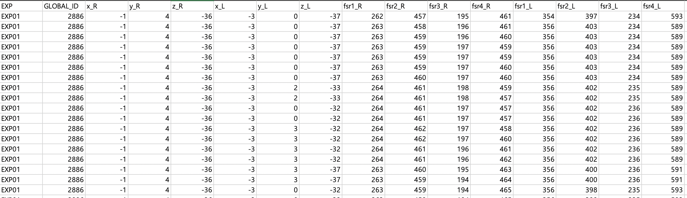

<p align="center">
    
</p>

## 🍫 The GILON Multi-task Dataset

Greeting from the GILON Multi-task Dataset!

This dataset is the joint work of GILON company and the UNIST Data Mining Lab. The dataset contains 72 people wearing smart insoles performing 14 different types of experiments.
Three different labels are given to each data chunk: type of action, running speed, and body weight. We release a pre-processed dataset with a time window of 4 seconds (160-time points per chunk, 40hz).

This multivariate time series dataset can be used to train and evaluate various applications with time series data, such as multi-task learning, time series classification, time series clustering, etc.


## 🤫 How to get access to the dataset?
This dataset is protected with the most strict license (CC-BY-NC-ND-4.0). TL;DR No commercial, no derivatives of the data, give appropriate credit when used.

In addition to the license, we only release the dataset for those who intend to use the dataset for **RESEARCH PURPOSES only.** You are not supposed to redistribute the data without our permission.
Those who wish to get access, please submit the below google form.


[📩 GOOGLE FORM 📩](https://forms.gle/QaS1BnGdYDixgEjJ6)

## 😽 Whatsup data?
We will send you a link containing four files if your application is processed.
```
test_feature_chunk40_window160_72users.csv
train_feature_chunk40_window160_72users.csv
test_label_chunk40_window160_72users.csv
train_label_chunk40_window160_72users.csv
```
The **feature** file contains the raw sensor signals collected from the 14 different sensors in the smart insole.
```
[x_R, y_R, z_R, x_L, y_L, z_L, fsr1_R, fsr2_R, fsr3_R, fsr4_R, fsr1_L, fsr2_L, fsr3_L, fsr4_L]
```
Here, [x,y,z] represents the three-axis accelerometer, and [fsr] represents the FSR sensors. R and L mean right and left, respectively.
The EXP column indicates the experiment number set. The GLOBAL_ID represents the global indicating number of the chunk. This can be used
to match the GLOBAL_ID in the label files.

Here is a snippet of how our feature file looks
<p align="center">
    
</p>
The train and test file contains 50 users and 22 users each. A five-fold split has been done on the training set and the users do not overlap between splits.

## 📝 Citation
If you have used our dataset, please cite our work below. Currently, the work is being validated in a single blind process.
```
@misc{Kim_GILON-MULTITASK_DATASET,
author = {Kim, Jaeho and Kang, Hyewon and Yang , Jaewan and Jung, Haneul and Lee, Seulki and Lee, Junghye},
title = {{GILON-MULTITASK DATASET}}
}
```

## 👩‍⚖️ License
Creative Commons Attribution-NonCommercial-NoDerivatives 4.0 International
This license is one of the most restrictive Creative Commons licenses. 

See the [LICENSE](LICENSE.md) file for license rights and limitations (CC-BY-NC-ND-4.0).